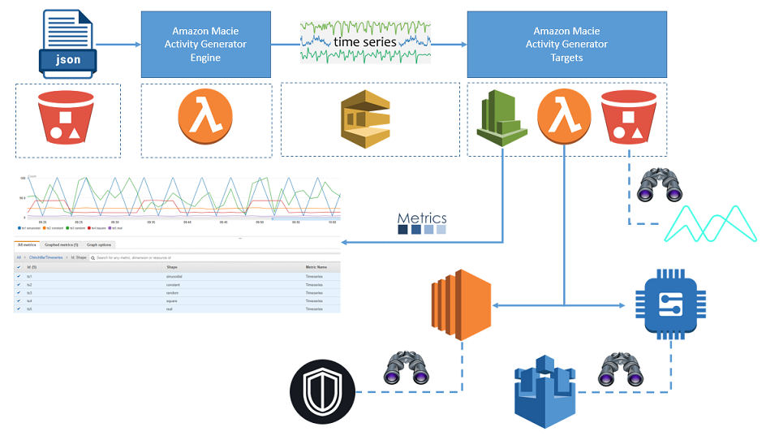
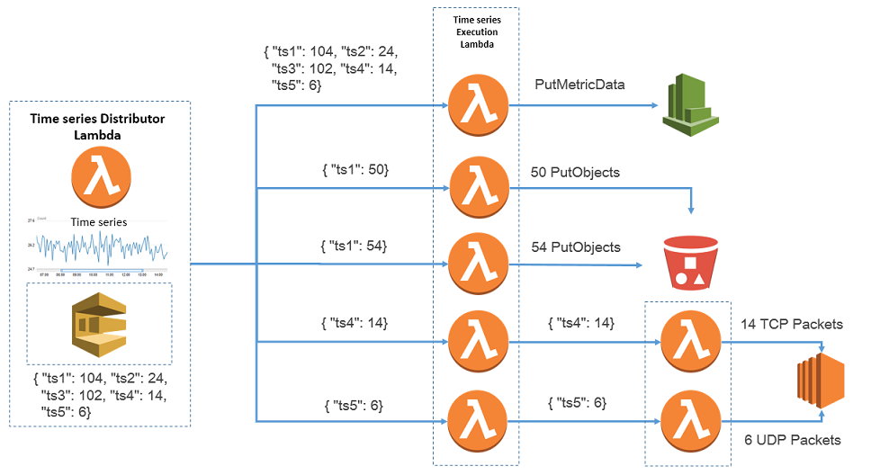

# Amazon Macie Activity Generator

**Anomaly detection systems** (i.e. [Amazon Macie](https://aws.amazon.com/macie/)) often perform quantitative analytics over timeseries derived from activities on their monitored subjects. While the core anomaly detection algorithms can be tested in isolation using test vectors, testing and measuring end to end performance and accuracy of these systems remain a challenge. **activity generator** aims to address at least a subset of these challenges via providing a platform to facilitate **timeseries generation, noise addition, anomaly injection** and **execution on target subjects** over an extended period of time. This platform offers generating synthetic timeseries as well as replaying real timeseries gathered from monitoring subjects in the past. 

The customers for this test platform are envisioned to be **SDEs** and **data scientists** building anomaly detection systems as well as **solution architects** and **customers** of these system. Builders can use activity generator during the development phase for fine tuning their systems and as a performance and accuracy canary for live systems. Solution architects could showcase and fine tune capabilities of anomaly detection systems with activity generator for customers and of course customers themselves can independently use it in similar manner.

While activity generator strives to be as extensible as possible to fit variety of use scenarios, it will be internally supporting common usecases to simplify its usage at least for solution architects and customers. For example, activity generator out of box has support for generating timeseries-based activities on S3 buckets (i.e. retrieving S3 objects, uploading S3 objects with various sensitive content) for showcasing and measuring effectiveness of anomaly detection analytics and data classification capabilities in [Amazon Macie](https://aws.amazon.com/macie/).

# High Level Architecture

Amazon Macie Activity Generator uses a serverless design and lives in native AWS world mainly relying on **AWS Lambda**, **SQS FIFO** and **CloudWatch Events**. Its customers can simply use a **CloudFormation** template to install their own dedicated version of activity generator fine tuned with their **custom blueprints** hosted in S3. The blueprint is a JSON file which programs activity generator's timeseries generation and delivery to targets. You can launch multiple activity generator stacks in the same account and have them programmed with different blueprints. While by default, activity generator will have access to targets (i.e. S3 buckets) within its home AWS account, you can also configure it to deliver the timeseries-based activities to targets (i.e. AWS Lambda function) in other AWS accounts. In the case of **cross-account targets**, you will need to manage the cross-account access permissions. To facilitate using this cross-account targets as well as allowing activity execution on behalf of **various principals**, you may specify AWS credentials or IAM roles to be used for executing activities on each target.



# Blueprint Anatomy

Blueprint is a JSON file that declares how activity generator will be **producing timeseries**, **injecting anomalies** and **delivering them to targets**. At a high level, this blueprint is composed of three main sections:

1. **commons**: baseline configuration for timeseries generation and anomaly injection, 
2. **generators**: configurations specific to each timeseries generator and overrides for commons, and 
3. **targets**: configuration for delivering timeseries and/or executing them on target destinations (i.e. CloudWatch, S3, Lambda).

```
{
    "commons": {
        ...
    },
    "generators": [
        ...    
    ],
    "targets": [
        ...
    ]
}
```

**SECURITY WARNING**: Blueprint files are assumed to **contain only trusted content** and vetted by activity generator stack operators prior to deployment. You need to fundamentally **think of blueprints as executable codes** which will have access to all things (i.e. computing environment, credentials) as activity generator lambda functions. activity generator uses python's "eval" to evaluate formulas for anomaly injection and custom shape timeseries generation. Hence, If you ever allow untrusted blueprints to be used for running activity generator that is basically opening up a fully fledged **code-injection** path. **Please refrain from setting up activity generator stacks with blueprints provided by untrusted individuals or systems**. Similarly activity generator stack owners/operators are responsible for actions executed on targets (i.e. GetObject on a S3 bucket) based on their blueprints.

## Common Settings

Below you see an example of blueprint with filled out **commons section**. In this blueprint, we are configuring activity generator to generate timeseries with a length of 20,160 data points. activity generator generates and delivers a single data point for every minute from starting time. Currently, there is a max limit of 14 days (= 14 * 24 * 60 = 20,160 data points) and after this period the same data points from each timeseries generator will be repeated.

Also, in this commons section you can see that we are configuring minimum and maximum value for generated data points (signal_min and signal_max). Hence, all the data points will be scaled to fit this range. Additionally, we are adding a **white-noise** to generated data points in a given range (noise_min and noise_max).

To **inject anomalies** in generated timeseries, we are specifying a range (anomalies.start and anomalies.end) on generated timeseries data points and ideal number of anomalies (anomalies.counts).      

```
{
    "commons": {
        "num_points": 20160,

        "signal_min": 1,
        "signal_max": 100,

        "noise_min": 1,
        "noise_max": 5,

        "anomalies": {
            "start": 1000,
            "end": 20000,
            "counts": 5
        }
    },
    "generators": [
        ...    
    ],
    "targets": [
        ...
    ]
}
```

By default, injected anomaly data points are calculated using formula: (max(datapoints) + 1) ^ 2. However, you can provide a **custom formula** for generating values for anomalous data points. This feature is implemented using python's eval and as mentioned above no untrusted value has to be ever allowed in this formula field. You may refer to the the chosen timeslot for injecting anomalous data point with variable **t** and all data points available in each timeseries using variable **datapoints**. For example:  

```
{
    "commons": {
        ...

        "anomalies": {
            "start": 1000,
            "end": 20000,
            "counts": 5,
            "formula": "max(datapoints) + t * 10"
        }
    },
    "generators": [
        ...    
    ],
    "targets": [
        ...
    ]
}
```

If you need to inject anomalies in more than one range within the generated data points, you can simply specify an array to "anomalies" section of blueprint. Though, you must note that if any of timeseries generators specify its own anomalies configuration then all of these anomalies defined in commons section would be overriden. Below blueprint shows an example of configuring **multiple anomaly injections**:

```
{
    "commons": {
        ...

        "anomalies": [{
            "start": 1000,
            "end": 2000,
            "counts": 5,
            "formula": "max(datapoints) + t * 10"
        },
        {
            "start": 5000,
            "end": 8000,
            "counts": 5,
            "formula": "10000"
        }]
    },
    "generators": [
        ...    
    ],
    "targets": [
        ...
    ]
}
```

## Timeseries Generators

Now that we know how to fill out the commons section of blueprint, we can dive into configuring the **timeseries generators**. Below, you can see an example of generators section.

**ts1** has a **sinusoidal** shape with frequency of 0.25 and default amplitude of 1.0. Of course, the generated datapoint by ts1 will be scaled to the range specified in commons section, adds the configured noise to them and injects anomalies on them before any use.

**ts2** produces a timeseries with a **constant** value of 20 (which similar to all other generators, data points will be adjusted based on noise and anomalies). You also can see how ts2 overrides the anomalies configuration to be different than what is in commons section.

**ts3** produces **random** data points with a uniform distribution. Other supported types for random timeseries are **triangular, betavariate, gammavariate, weibullvariate, normalvariate, lognormvariate, expovariate, vonmisesvariate**, and **paretovariate**. For parameters available for configuring each of these random generator types, you may refer to [[https://docs.python.org/2/library/random.html]].

**ts4** produces **sqaure** shaped timeseries with given low value of 10 with width of 2 data points (minutes), and high value of 40 with width of 3 data points. Hence, an example timeseries for ts4, before applying noise and injecting anomalies, looks like: 10, 10, 40, 40, 40, 10, 10, 40, 40, 40,.... after apply noise, these series could look like: 11, 9, 45, 42, 39, 10, 11, 43, 43, 40,.... and after injecting anomalies it could transform to something like: 11, 9, 45, 42, 39, 200, 250, 43, 43, 40,....  

In addition to **synthetic timeseries**, activity generator supports replaying **real data timeseries**. The last generator in this blueprint (**ts5**) is configured to pull in data points from a referenced S3 object. This S3 object must contain one data point per line and activity generator will ignore empty lines. If the total number of data points in this S3 object is less than "num_points" specified in the commons section of blueprint or generator's own config section, the remaining time slots will be filled by zeros. Also, data points beyond "num_points" will be ignored even in the future cycles of timeseries generation. 

```
{
    "commons": {
        ...
    },
    "generators": [
        {
            "id": "ts1",
            "shape": "sinusoidal",
            "config": {
                "frequency": 0.25
            }
        },
        {
            "id": "ts2",
            "shape": "constant",
            "config": {
                "constant": 20,
                "anomalies": {
                    "start": 80,
                    "end": 85,
                    "counts": 1
                }
            }
        },
        {
            "id": "ts3",
            "shape": "random",
            "config": {
                "type": "uniform"
            }
        },
        {
            "id": "ts4",
            "shape": "square",
            "config": {
                "high_value": 40,
                "low_value": 10,
                "high_width": 3,
                "low_width": 2
            }
        },
        {
            "id": "ts5",
            "shape": "real",
            "config": {
                "bucket": "...",
                "key": "sample-timeseries.dat"
            }
        }
    ],
    "targets": [
        ...
    ]
}
```

If you would like to define your own **formula for synthetic timeseries** generation, you can specify "custom" as your timeseries shape and provide a "formula" in its configuration. This feature is implemented using python's eval and as mentioned above no untrusted value has to be ever allowed in this formula field. You may refer to the the chosen timeslot for calculating its value with variable **t**. For example:

```
{
    "commons": {
        ...
    },
    "generators": [
        ...
        {
            "id": "ts6",
            "shape": "custom",
            "config": {
                "formula": "t * 10"
            }
        }
    ],
    "targets": [
        ...
    ]
}
```

## Timeseries Targets

The ultimate goal from generating timeseries is to execute or deliver them to targets. Below you can find an example of **target section** in a activity generator blueprint. There are currently three types of AWS targets supported: **S3** (customized for simulating S3 Put/Get activities), **CloudWatch** (for visualization of timeseries) and **Lambda** (as delegation point to all other target types). 

In the example below, the first target is defined for simulating **PutObject** activities on a given S3 bucket based on timeseries of ts1 and ts2. The S3 objects created dynamically are configured to contain given number of fake data of various types (i.e. **bank account numbers, credit card numbers, social security numbers, phone numbers, addresses, cryptographic materials** and **credentials**). All these S3 activities will happen under the identity of activity generator Lambda (i.e. IAM role). However, you can specify a role or specific set of AWS credentials to be used instead of the default identity. 

You can see an example of this **identity specification** in the second target defined below. This target definition specifies a S3 bucket for being a target of GetObject activities based on data points in timeseries ts3 and ts4. Additionally, to make sure that all the **GetObject** calls for each given data point can complete within a 5 minutes time window (Lambda's maximum running time), you can **slice and deliver each data point** to multiple lambda runs. For example, in this target, if a data point of 350 is received, it will be sliced to three data points of 100, 100 and 50, and dispatched to three separate Lambda invocations to make the corresponding GetObject calls in parallel.

In some scenarios, you might need to pass all data points (from the same time slot) to a target together. For example, if you have a custom Lambda function to assemble a document with various fields tracking values from various data points in a time slot, then you can configure your target with **grouped datapoints **and your Lambda function will receive all data points for the same time slot together. Please note that in this mode, you will not be able to use data point slicing anymore. In the example diagram below you can see that "cloudwatch" target is configured with "group_datapoints": true.

The third target is an **AWS Lambda** invocation where data points generated by ts1 are delivered to Lambda function "net_fuzz" which in turn will generate corresponding number of fuzzed TCP packets and sends them to IP address of 10.0.0.9 on port number 80. If the Lambda function exist in the same account and region as activity generator Lambda itself, you can simply specify the target Lambda function's name in the function field. However, if the Lambda function is in a different account or region, then you would have to specify Lambda function's ARN. Additionally, you need to ensure that activity generator is whitelisted invoking the target Lambda function.  

And the last target is of **CloudWatch** type where we are sending data points from all timeseries generators as metric data under CloudWatch namespace of "Test/Timeseries". The CloudWatch metrics will have two dimensions of Shape and Id corresponding to values specified in the blueprint for timeseries generators. Looking at the metrics created in CLoudWatch, for each metric you will see sample count of one per minute. Also to see the data points delivered to targets you should have the graph shown for statistics type of "sum" and for periods of 1 minute. 

```
{
    "commons": {
        ...
    },
    "generators": [
        ...
    ],
    "targets": [
        {
            "type": "s3",
            "prefix": "sensitive/",
            "action": "put",
            "generators": ["ts1", "ts2"],
            "fake_types": ["bban", "iban", "credit_card_full", "phone_number", "ssn", "address",
                           "rsa", "dsa", "ec", "pgp", "aws_creds", "facebook_creds", "slack_creds",
                           "github_creds"],
            "fake_counts": 20
        },
        {
            "type": "s3",
            "action": "get",
            "slice_size": 100,
            "generators": ["ts3", "ts4"],
            "role": {
                "arn": "...",
                "external_id": "...",
                "session_name": "..."
            }
        },
        {
            "type": "lambda",
            "function": "net_fuzz",
            "generators": ["ts1"],
            "port": 80,
            "ip": "10.0.0.9"
        },
        {
            "type": "cloudwatch",
            "namespace": "Test/Timeseries",
            "generators": ["ts1", "ts2", "ts3", "ts4", "ts5"],
            "group_datapoints": true
        }
    ]
}
```

# Timeseries Execution

The diagram below shows an example of how activity generator executes data points from generated timeseries on various targets in parallel. Data points are executed on or delivered to target every minute (triggered by a scheduled rule in CloudWatch events). By default, each data point for each target will run on its own lambda invocation and all errors will be only retried based on internal logic implemented. Hence, there is no reliance on AWS Lambda's default retries on errors and even the timeouts are prevented to avoid any auto-retries because of that. This design is to ensure that the data points are only once delivered or executed on targets within their expected time slots. No time machine no going back in time!



To get a better picture of how data points from timeseries are executed on targets, imagine a timeseries of **ts1** with data points of {1, 2, 4, 3, 2, 2, 3, 1} which is executed on a S3 bucket with "put" actions. The execution on target bucket is done through delivering objects in each time slot mapping to data point value of that time slot. The following diagram visualizes this timeseries execution:


For **AWS Lambda targets**, they will be invoked by activity generator with an **event parameter JSON formatted** as shown in the example below:

```
{
   "action": "execute-datapoints",
   "source": "amazon-macie-activity-generator",
   "target": {
       "function": "test",
       "group_datapoints": true,
       "type": "lambda"
   },
   "timestamp": "2018-02-27T18:33:37Z",
   "datapoints": [
       {
           "generator_id": "ts1",
           "value": 12
       },
       {
           "generator_id": "ts2",
           "value": 20
       }
   ]
} 
```

# Installation

## Prerequisites:

1) Launch an EC2 instance with Amazon Linux AMI.
2) Prepare the EC2 host to compile Software using: sudo yum groupinstall "Development Tools"
3) Upgrade your pip on the EC2 host using: sudo pip install --upgrade pip
4) Fix path to pip after upgrade: hash -r 

## Build and Deploy:

You can use "deploy" script found in activity generator package to install it using CloudFormation:
 
./deploy DEPLOYMENT_S3_BUCKET_NAME [CLOUDFORMATION_STACK_NAME] [CONFIGURATION_FILE_S3_KEY]

**Note**: Your EC2 instance profile (or the identity correponding to override AWS credentials if setup using environment variables) needs to have permissions for writing to S3 bucket: DEPLOYMENT_S3_BUCKET_NAME and create a CloudFormation stack with specified resources in the CloudFormation template (./resource/CloudFormationTemplate.yaml).  

By default, the CloudFormation stack is named "amazon-macie-activity-generator" and a default configuration file (./resources/DefaultBlueprint.json) is used. However, you may override these default values in command line parameters.

